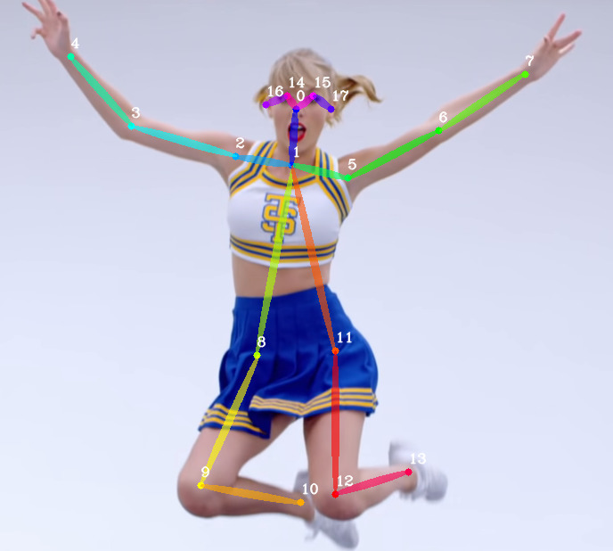

# Train on custom dataset

It will require some :clock1:, but here is the guide from :zero: to :muscle:. In the end you will feel :shipit: :neckbeard: :godmode:, I guarantee that!

## Preface

### What is `BODY_PARTS_KPT_IDS` and `BODY_PARTS_PAF_IDS`?

Both lists are related to grouping keypoints into person instances. Network predicts two tensors: the first with keypoint heatmaps, to localize all possible keypoints of each type (neck, left shoulder, right shoulder, left elbow, etc.) and the second with connections between keypoints of predefined type.

From the heatmaps we can extract coordinates of all keypoints, which network was able to find. Now these keypoints need to be grouped into persons. It is very easy to do if only one person can be inside an image: beacuse we have already knew keypoints coordinates and their type, so all found keypoints belong to the desired person. Situation becomes harder if multiple persons may be present inside an image. What we can do in this case? For example, network finds two keypoints of right shoulder and only one neck. One neck keypoint is good, possibly can extract pose of one person. But there are two right shoulder keypoints. We know, that single pose contain at most one right shoulder. Which one we should choose? It is tricky, but let network help us.

To group keypoints into persons instances, network learns to predict connections between keypoints of each person. Like a bones of skeleton. So once we know, which keypoints are connected between each other, the full pose can be read, starting from the first keypoint and checking if it is connected with other keypoints. Once connections between the fist keypoint and its neighbouring keypoints are established, we continue to assemble keypoints into pose by exploring neighbouring keypoints and keypoints with which they are connected, and so on. Pairs of keypoint indices, between which network should predict connection, are exactly what is defined in [`BODY_PARTS_KPT_IDS`](https://github.com/Daniil-Osokin/lightweight-human-pose-estimation.pytorch/blob/master/modules/keypoints.py#L5-L6) list. Let's check the pose scheme image:

<p align="center">
  
</p>

You see, pair `[1, 5]` corresponds to connection between keypoints with indices `1` and `5`, which is neck and left shoulder. Pair `[14, 16]` corresponds to right eye and right ear keypoints. These pairs are defined (by you) before the training, because network needs to know, connection between which keypoints it should learn. [`BODY_PARTS_PAF_IDS`](https://github.com/Daniil-Osokin/lightweight-human-pose-estimation.pytorch/blob/master/modules/keypoints.py#L7-L8) list defines indices of network output channels which encodes connection between corresponding keypoints pair. PAF stands for part affinity field, it is a term from the [original paper](https://arxiv.org/pdf/1611.08050.pdf), which describes connection between keypoints pair.

### How to choose pairs of keypoints to connect?

One may select all-to-all connection scheme, thus having `(number keypoints) * (number keypoints - 1)` keypoint pairs (keypoint connection with itself is skipped as useless for grouping into instances purpose). If number of keypoints is 18, and all-to-all connection scheme is used, then network needs to learn `18 * 17 = 306` connections between keypoints. Large number of connections makes network more complex and slower, but gives more accurate grouping: because each keypoint is connected to any other keypoint of this person, and, for example, if network fails to detect connection between right elbow and right shoulder, we may group right elbow into pose by checking connection between right elbow and neck or with other keypoints.

Actual number of keypoints pairs is a trade-off between network inference speed and accuracy. In this work there are 19 keypoint pars. However, there is **best practice:** it makes sence to define a special root keypoint, which is connected with the rest keypoints for the better accuracy (as discussed above). Usually the most robust keypoint, which is rarely occluded and easy to detect, is a good candidate for root keypoint. The root keypoint serves as the first keypoint to start grouping. For persons it is usually neck or pelvis (or both, or even more, it is a trade-off).

### How connections between keypoints pairs are implemented at network level?

Connection between keypoints pair is represented as a unit vector between these keypoints. So for given keypoint `a` with coordinates (x<sub>a</sub>, y<sub>a</sub>) and keypoint `b` with coordinates (x<sub>b</sub>, y<sub>b</sub>) such unit vector c<sub>ba</sub> is computed as: (x<sub>b</sub>-x<sub>a</sub>, y<sub>b</sub>-y<sub>a</sub>), then normalized by its length. All pixels between keypoints from the pair are contain this vector. Network predicts two separate channels: one for `x` component and one for `y` component of connection vector for each keypoints pair as its output. So for 19 keypoints pairs the network will predict `19 * 2 = 38` channels for connections between keypoints. At inference time, we do exaustive search between all keypoints of specific types from keypoints pair, and compare the vector formed by these keypoints with the learned one by network. If vectors are matched, then these keypoints are connected. Indices of the network output channels for `x` and `y` components of connection vector for corresponding keypoints pair are stored in [`BODY_PARTS_PAF_IDS`](https://github.com/Daniil-Osokin/lightweight-human-pose-estimation.pytorch/blob/master/modules/keypoints.py#L7-L8) list.


### How persons keypoints are grouped into instances?

As we discussed above, the network outputs two tensors: keypoints and connections between predefined keypoints pairs. We will start from the first such pair `[1, 2]` from [`BODY_PARTS_KPT_IDS`](https://github.com/Daniil-Osokin/lightweight-human-pose-estimation.pytorch/blob/master/modules/keypoints.py#L5-L6) list, which is neck and right shoulder. Lines [63-92](https://github.com/Daniil-Osokin/lightweight-human-pose-estimation.pytorch/blob/master/modules/keypoints.py#L63-L92) handle corner cases, when one or both keypoints types from pair are missed. In these cases all existed poses instances (`pose_entries`) are checked if they contain current keypoint. So if network does not find any right shoulder keypoint, all found neck keypoints will be checked if they already belong to existed poses, if not a new pose instance with this keypoint is created.

Lines [94-141](https://github.com/Daniil-Osokin/lightweight-human-pose-estimation.pytorch/blob/master/modules/keypoints.py#L94-L141) verify which of found keypoints (of particular type from the pair) are connected by doing exhaustive search between them and checking if learned connection vector corresponds to the vector between keypoints locations.

Lines [159-193](https://github.com/Daniil-Osokin/lightweight-human-pose-estimation.pytorch/blob/master/modules/keypoints.py#L159-L193) assign connected keypoints to one of existed pose instances. If it is the first keypoint pair ([`part_id == 0`](https://github.com/Daniil-Osokin/lightweight-human-pose-estimation.pytorch/blob/master/modules/keypoints.py#L159)) a new pose instance is created, containing both keypoints. Else current keypoints pair will be assigned to that pose instance, which already [contain the first from these keypoints](https://github.com/Daniil-Osokin/lightweight-human-pose-estimation.pytorch/blob/master/modules/keypoints.py#L159), e.g. if current pair of keypoints is right shoulder and right elbow, then right elbow will be assigned to pose instance, which already has right shoulder with particular coordinates (assigned at previous step with neck and right shoulder pair). If no pose instance found, which contains the first keypoint from pair, then a new pose instance [is created](https://github.com/Daniil-Osokin/lightweight-human-pose-estimation.pytorch/blob/master/modules/keypoints.py#L159). And one by one, all keypoints pairs are processed. As you can see, if keypoints pairs order (and order of keypoints in a pair) in [`BODY_PARTS_KPT_IDS`](https://github.com/Daniil-Osokin/lightweight-human-pose-estimation.pytorch/blob/master/modules/keypoints.py#L5-L6) list is random, then multiple pose instances from disjoint keypoints pairs will be created instead of one instance with all keypoints. That is why the order of keypoints pairs matters and root keypoint is useful to connect keypoints more robustly.

We have talked here about person poses, however the same considerations may be applied for different object types.

## Dataset format

The easiest way is to use annotation in [COCO](http://cocodataset.org/#format-data) format. So if you need to label dataset, consider [coco-annotator](https://github.com/jsbroks/coco-annotator) tool (possibly there are alternatives, but I am not aware of it). If there is already annotated dataset, just convert it to COCO [format](http://cocodataset.org/#format-data).

Now convert dataset from COCO format into [internal](https://github.com/Daniil-Osokin/lightweight-human-pose-estimation.pytorch#training) format:

```
python scripts/prepare_train_labels.py --labels custom_dataset_annotation.json
```

## Modifications of the training code

1. Original COCO keypoins order are converted to internal one. It is not necessary for training on new data, so [`_convert`](https://github.com/Daniil-Osokin/lightweight-human-pose-estimation.pytorch/blob/master/datasets/transformations.py#L36) can be safely removed.

2. Modify keypoints indices to properly [swap](https://github.com/Daniil-Osokin/lightweight-human-pose-estimation.pytorch/blob/master/datasets/transformations.py#L252) left and right sides of object.

3. Set own [`BODY_PARTS_KPT_IDS`](https://github.com/Daniil-Osokin/lightweight-human-pose-estimation.pytorch/blob/master/datasets/coco.py#L13) to define keypoints pairs for grouping.

4. Set output channels number for keypoints `num_heatmaps` as number of keypoints to detect + 1 for a background and connections between keypoints `num_pafs` for [network object](https://github.com/Daniil-Osokin/lightweight-human-pose-estimation.pytorch/blob/master/train.py#L26). For example, if new object has 5 keypoints and defined 4 keypoints pairs for grouping, then network object is created as:

```
net = PoseEstimationWithMobileNet(num_refinement_stages, num_heatmaps=6, num_pafs=8)
```

`num_pafs` is 8 because each connection encoded as 2 output channels for `x` and `y` component of vector between keypoints from pair.

5. For proper network inference and validation set new keypoints indices pairs in [`BODY_PARTS_KPT_IDS`](https://github.com/Daniil-Osokin/lightweight-human-pose-estimation.pytorch/blob/master/modules/keypoints.py#L5-L6) and corresponding indices of network output channels for connections between keypoints in pairs in [`BODY_PARTS_PAF_IDS`](https://github.com/Daniil-Osokin/lightweight-human-pose-estimation.pytorch/blob/master/modules/keypoints.py#L7-L8).

6. To run a standalone validation, modify [network object creation](https://github.com/Daniil-Osokin/lightweight-human-pose-estimation.pytorch/blob/master/val.py#L174) accordingly to new number of learned keypoints and connections between them.

## Congratulations

My congratulations, now you are pose estimation master :sunglasses:! May the force be with you! :accept:

